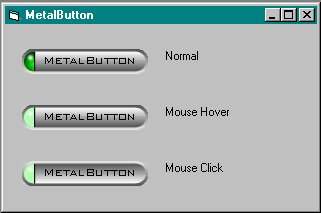



## MetalButton OCX \- Custom Button Control

### Description

Add a cool interactive 3D metallic button to your VB applications. UPDATED 08/26/02: Finally masked the gray edges! No flickering. Three colors (R,G,B). Realtime resizing. Editable button font.
 
### More Info
 
Read the included README for more information.

             |
---                |---
**Submitted On**   |2002-08-26 17:00:42
**By**             |[Matt Snyder](https://github.com/Planet-Source-Code/PSCIndex/blob/master/ByAuthor/matt-snyder.md)
**Level**          |Intermediate
**User Rating**    |4.5 (36 globes from 8 users)
**Compatibility**  |VB 5\.0, VB 6\.0
**Category**       |[OLE/ COM/ DCOM/ Active\-X](https://github.com/Planet-Source-Code/PSCIndex/blob/master/ByCategory/ole-com-dcom-active-x__1-29.md)
**World**          |[Visual Basic](https://github.com/Planet-Source-Code/PSCIndex/blob/master/ByWorld/visual-basic.md)
**Archive File**   |[MetalButto1228138262002\.zip](https://github.com/Planet-Source-Code/matt-snyder-metalbutton-ocx-custom-button-control__1-38222/archive/master.zip)

